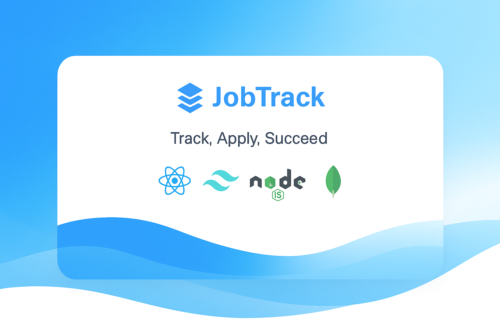
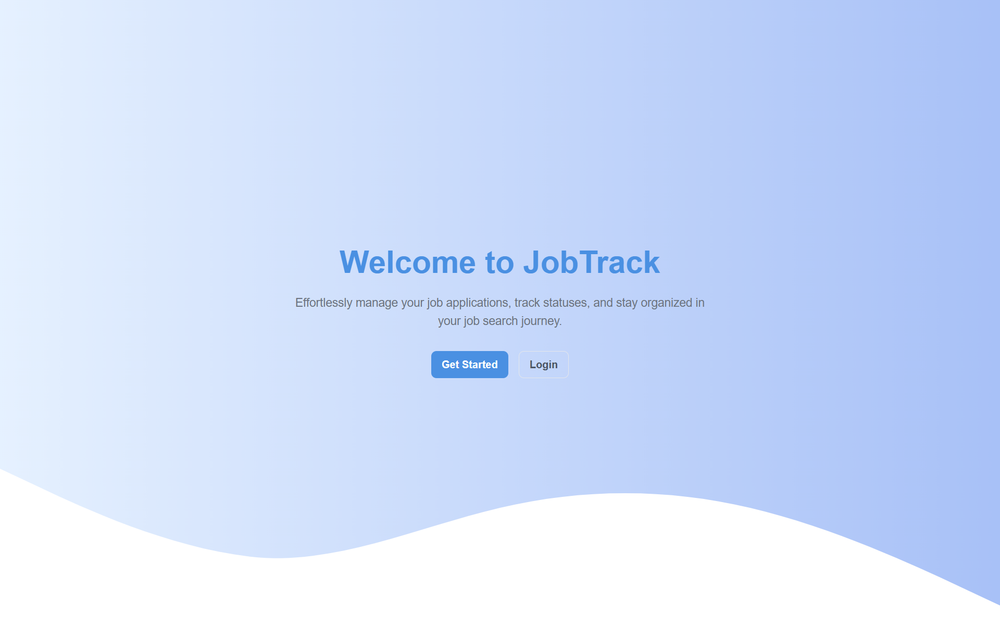
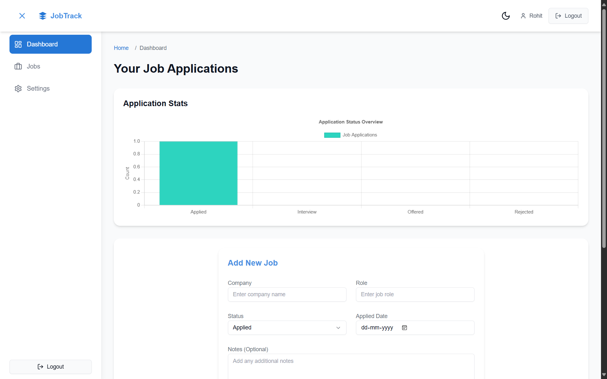
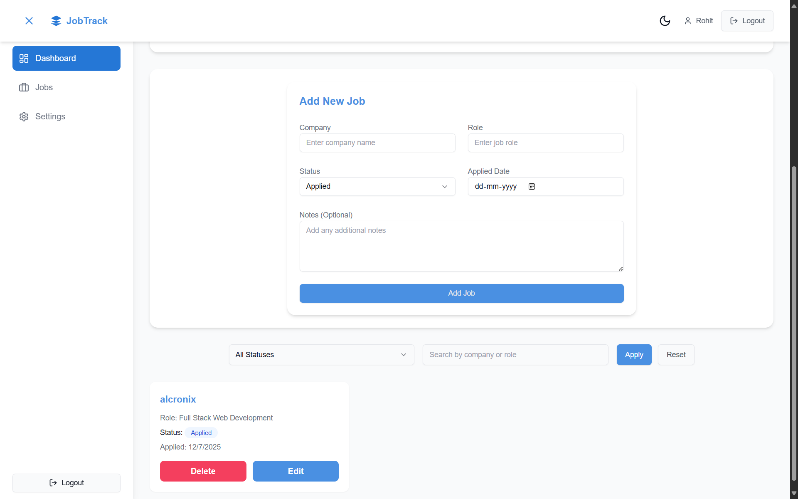
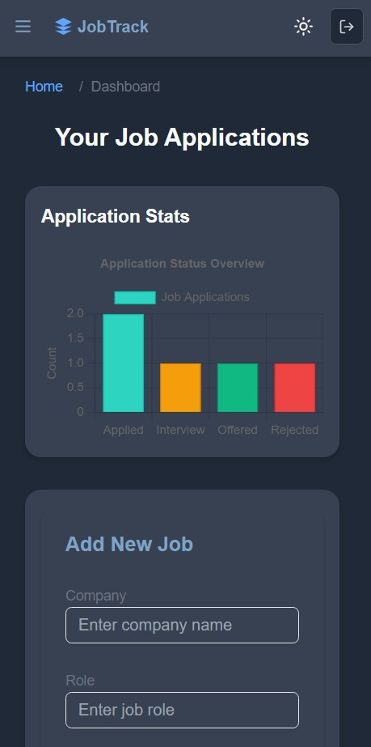

# Job Tracker



[](https://github.com/RohitBansal-github/job-tracker-app/blob/main/LICENSE)
[](https://github.com/RohitBansal-github/job-tracker-app/stargazers)
[](https://github.com/RohitBansal-github/job-tracker-app/network)
[](https://github.com/RohitBansal-github/job-tracker-app/issues)

## Table of Contents
- [Project Overview](#project-overview)
- [Features](#features)
- [Tech Stack](#tech-stack)
- [Folder Structure](#folder-structure)
- [Live Links](#live-links)
- [Getting Started](#getting-started)
- [Environment Variables](#environment-variables)
- [API Documentation](#api-documentation)
- [Component Navigation](#component-navigation)
- [Screenshots](#screenshots)
- [Contributing Guidelines](#contributing-guidelines)
- [Known Issues](#known-issues)
- [License](#license)
- [Credits](#credits)

## Project Overview
**Job Tracker** is a web application designed to help job seekers manage their applications efficiently. Users can track application details, filter by status, and modern interface. Built with a robust tech stack, it’s a valuable tool for job seekers and a showcase of full-stack development for developers.

**Why it’s useful**: Job Tracker streamlines the job search process, reducing stress by organizing applications and providing actionable insights. Its intuitive design and secure authentication make it accessible and extensible.

## Features
- 🔒 **User Authentication**: Secure login and signup with JWT.
- 📋 **Job Management**: Create, read, update, and delete job applications with details like company, position, status, and notes.
- 🔍 **Job Status Filters**: Sort applications by *Applied*, *Rejected*, or *Accepted* statuses.
- 📱 **Responsive UI**: Mobile-friendly design with a vibrant blue gradient wave background.

## Tech Stack
| Layer       | Technology                     |
|-------------|--------------------------------|
| Frontend    | React.js, Vite, Tailwind CSS   |
| Backend     | Node.js, Express.js            |
| Database    | MongoDB, Mongoose              |
| Authentication | JWT                         |
| Hosting     | Vercel (Frontend), Render (Backend) |

## Folder Structure
```
job-tracker/
├── public/                   # Static assets
│   ├── favicon.ico          # Website favicon
│   ├── index.html           # HTML entry point
│   └── assets/              # Images and static files
│       └── logo.png         # App logo
├── src/                     # Frontend source code
│   ├── assets/              # Frontend assets
│   │   └── wave-bg.png      # Wave background image
│   ├── components/          # React components
│   │   ├── JobForm.jsx      # Form for creating/editing jobs
│   │   ├── JobCard.jsx      # Card for displaying job details
│   │   ├── Filters.jsx      # Filter jobs by status/date
│   │   ├── Sidebar.jsx      # Navigation sidebar
│   │   ├── Navbar.jsx       # Top navigation bar
│   │   └── Notification.jsx # Real-time notification component
│   ├── pages/               # Page components
│   │   ├── Home.jsx         # Homepage with wave background
│   │   ├── Dashboard.jsx    # Dashboard for job management
│   │   ├── Login.jsx        # Login page
│   │   └── Signup.jsx       # Signup page
│   ├── App.jsx              # Main app component
│   ├── main.jsx             # Entry point for React
│   └── tailwind.config.js   # Tailwind CSS configuration
├── server/                  # Backend source code
│   ├── controllers/         # Route handlers
│   │   ├── authController.js # Authentication logic
│   │   └── jobController.js  # Job management logic
│   ├── models/              # Mongoose schemas
│   │   ├── User.js          # User schema
│   │   └── Job.js           # Job schema
│   ├── routes/              # Express routes
│   │   ├── authRoutes.js    # Authentication routes
│   │   └── jobRoutes.js     # Job management routes
│   ├── middleware/          # Middleware
│   │   └── authMiddleware.js # JWT authentication middleware
│   ├── server.js            # Backend entry point
│   └── .env                 # Environment variables
├── .env                     # Frontend environment variables
├── package.json             # Frontend dependencies
├── vite.config.js           # Vite configuration
└── README.md                # Project documentation
```

## Live Links
| Component  | Live Link                                      |
|------------|------------------------------------------------|
| Homepage   | [https://jobtracker-client.vercel.app](https://job-tracker-app-steel.vercel.app/)           |   |

## Getting Started
### Prerequisites
- Node.js (v16 or higher)
- MongoDB account (for `MONGO_URI`)
- Git
- Vercel and Render accounts (for deployment)

### Installation
1. **Clone the repository**:
   ```bash
   git clone https://github.com/RohitBansal-github/job-tracker-app.git
   ```
2. **Set up the frontend**:
   ```bash
   cd job-tracker
   npm install
   npm run dev
   ```
   The frontend runs on `http://localhost:5173`.
3. **Set up the backend**:
   ```bash
   cd server
   npm install
   ```
   Create a `.env` file in the `server` folder:
   ```
   MONGO_URI=your_mongodb_uri
   JWT_SECRET=your_jwt_secret
   PORT=5000
   ```
   Run the backend:
   ```bash
   npm start
   ```
   The backend runs on `http://localhost:5000`.
4. **Configure CORS**: Allow requests from `http://localhost:5173` or `https://jobtracker-client.vercel.app`.

## Environment Variables
| Variable    | Description                     |
|-------------|---------------------------------|
| `MONGO_URI` | MongoDB connection URI         |
| `JWT_SECRET`| Secret key for JWT signing     |
| `PORT`      | Backend server port (default: 5000) |

## API Documentation
Interact with the backend at `https://jobtracker-api.onrender.com` or `http://localhost:5000`. Use `Authorization: Bearer <token>` for protected routes.

| Route              | Method | Description                | Auth Required | Params                        |
|--------------------|--------|----------------------------|---------------|-------------------------------|
| `/api/auth/register`| POST   | Register a new user        | ❌            | `email`, `password`           |
| `/api/auth/login`  | POST   | User login                 | ❌            | `email`, `password`           |
| `/api/users/me`    | PUT    | Update user profile        | ✅            | `email`                       |
| `/api/jobs`        | POST   | Create a job application   | ✅            | `company`, `position`, `status`, `appliedDate`, `notes` |
| `/api/jobs`        | GET    | Get all jobs               | ✅            | None                          |
| `/api/jobs/:id`    | PUT    | Update a job application   | ✅            | `company`, `position`, `status`, `appliedDate`, `notes` |
| `/api/jobs/:id`    | DELETE | Delete a job application   | ✅            | None                          |

## Component Navigation
| Component     | Description                     | Render Link              |
|---------------|---------------------------------|--------------------------|
| JobForm       | Create/Edit job applications    | `/dashboard/jobform`     |
| JobCard       | Display job details             | `/dashboard`             |
| Notification  | Show status alerts              | Global                   |
| Filters       | Filter jobs by status           | `/dashboard`             |

## Screenshots

*Homepage with vibrant blue gradient wave background*


*Dashboard displaying job cards and status filters*


*JobForm for creating or editing job applications*


*Mobile-friendly interface with sidebar and filters*

## Contributing Guidelines
We welcome contributions! Follow these steps:
1. Fork the repository.
2. Create a feature branch: `git checkout -b feature/YourFeatureName`.
3. Commit changes: `git commit -m "Add YourFeatureName"`.
4. Push to your fork: `git push origin feature/YourFeatureName`.
5. Submit a pull request with a clear description.
See [CONTRIBUTING.md](CONTRIBUTING.md) for details.

## Known Issues
- **CORS Errors**: Ensure backend CORS allows `http://localhost:5173` or `https://jobtracker-client.vercel.app`.
- **MongoDB Connection**: Verify `MONGO_URI` is correct and accessible.
- **Responsive Layout**: Test `Filters` and `Sidebar` on mobile for alignment.

## License
This project is licensed under the MIT License. See the [LICENSE](LICENSE) file for details.

## Credits
- **Developer**: [Rohit Bansal](https://github.com/RohitBansal-github)
- **Technologies**: [React](https://reactjs.org/), [Tailwind CSS](https://tailwindcss.com/), [shadcn UI](https://ui.shadcn.com/), [Express](https://expressjs.com/)
- **Inspiration**: Open-source community and job search platforms
```
